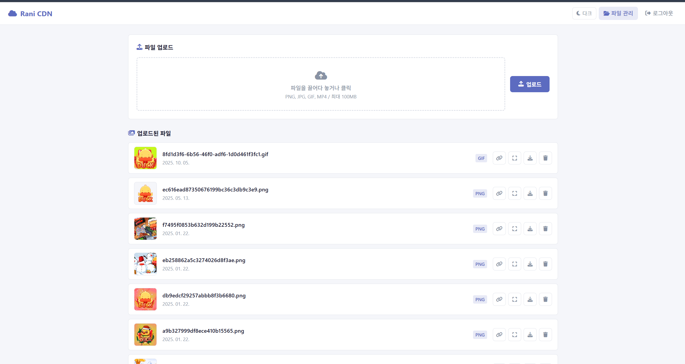

# Rani CDN

## 프로젝트 소개

`Rani CDN`은 이미지와 비디오 파일을 손쉽게 업로드하고 관리할 수 있도록 만든 관리자 전용 파일 호스팅 서비스입니다.  
단순 업로드 기능에 그치지 않고, **업로드 → 미리보기 → URL 복사 → 다운로드 및 삭제**까지 한 화면에서 처리할 수 있도록 구성해 실제 사용성을 높였습니다.

특히 웹사이트 이미지 자산 관리, 커뮤니티 운영, 개인 프로젝트 리소스 정리처럼 **파일을 빠르게 업로드하고 외부에서 바로 사용할 수 있는 링크가 필요한 상황**을 고려해 개발했습니다.

## 주요 기능

- **파일 업로드 지원**: PNG, JPG, JPEG, GIF, MP4 형식 업로드 가능
- **드래그 앤 드롭 UI**: 파일을 끌어다 놓거나 클릭해 직관적으로 업로드 가능
- **미리보기 기능**: 업로드 전 이미지 및 비디오 파일을 바로 확인 가능
- **파일 관리 기능**: 업로드된 파일 목록을 확인하고 정리 가능
- **URL 복사 기능**: 클릭 한 번으로 업로드된 파일의 링크를 바로 복사 가능
- **다운로드 및 삭제 기능**: 파일을 쉽게 관리할 수 있도록 보기, 다운로드, 삭제 지원
- **다크 모드 지원**: 사용자 환경에 맞춘 테마 전환 가능
- **관리자 로그인**: 세션 기반 인증으로 관리자만 접근 가능

## 기술 스택

| 구분 | 기술 |
|------|------|
| Backend | Node.js, Express |
| Frontend | HTML, CSS, Vanilla JavaScript |
| Upload | Multer |
| Session/Auth | express-session |
| Security | Helmet |
| Utility | fs-extra, uuid, dotenv |

## 느낀 점

이 프로젝트를 통해 단순한 파일 업로드 기능을 넘어서, **실제로 사용할 수 있는 파일 관리 서비스는 어떤 흐름으로 구성되어야 하는지** 고민해볼 수 있었습니다.  
특히 Express 기반 서버에서 파일 업로드 처리, 세션 인증, 정적 파일 제공, URL 생성 로직을 함께 연결하는 방법을 익혔고, 프론트엔드에서는 사용자 입장에서 편리한 업로드 경험을 만드는 과정의 중요성을 느꼈습니다.

또한 파일 형식 제한, 로그인 처리, 삭제 기능 같은 요소들을 구현하면서 작은 서비스라도 **보안, 사용성, 관리 편의성**을 함께 고려해야 완성도가 높아진다는 점을 배울 수 있었습니다.
