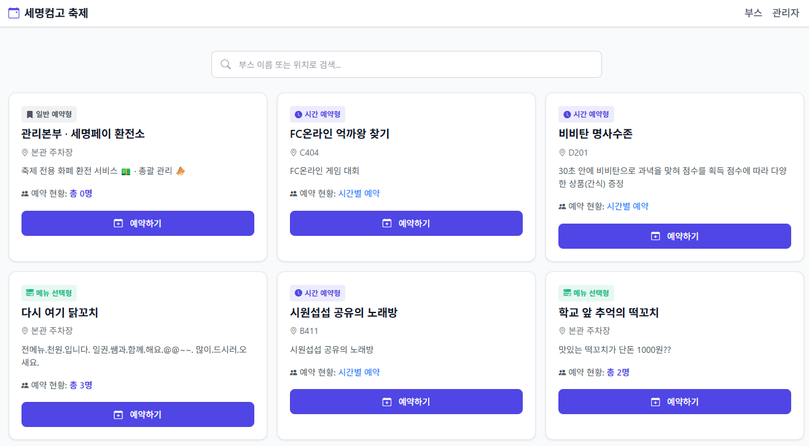
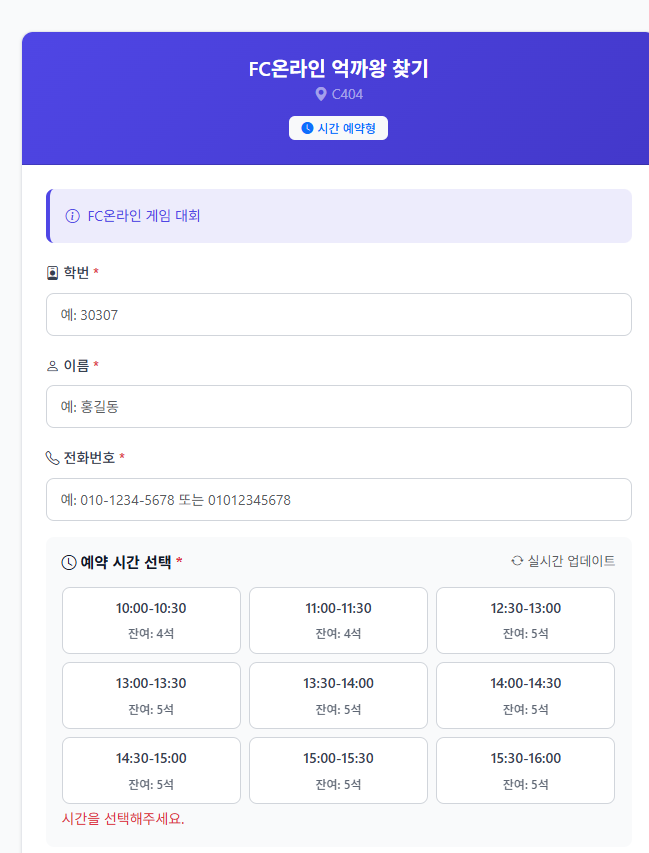

# 축제 부스 예약 시스템

## 프로젝트 소개

학교 축제에서 여러 부스의 예약을 한 곳에서 관리할 수 있도록 만든 웹 기반 예약 시스템입니다. 학생은 메인 화면에서 부스 정보를 확인하고 원하는 부스를 바로 예약할 수 있고, 관리자 페이지에서는 예약 현황을 실시간으로 확인하며 운영 상태를 제어할 수 있습니다.

특히 부스마다 운영 방식이 다른 축제 환경을 반영해 **일반 예약형**, **시간 예약형**, **메뉴 선택형**을 하나의 서비스 안에서 지원하도록 구성했습니다. 단순히 예약만 받는 페이지가 아니라, 현장 운영자와 학생 사용자 모두가 빠르게 사용할 수 있는 흐름을 만드는 데 집중한 프로젝트입니다.

## 주요 기능

- **부스 통합 조회**  
  메인 페이지에서 전체 부스를 카드 형태로 확인할 수 있고, 부스 이름·위치·설명을 검색하며 빠르게 원하는 예약처를 찾을 수 있습니다.

- **다양한 예약 방식 지원**  
  부스 성격에 따라 일반 예약, 시간대별 예약, 메뉴/옵션 선택형 예약을 지원해 축제 현장에 맞는 유연한 예약 경험을 제공합니다.

- **실시간 예약 현황 반영**  
  부스별 예약 수와 예약 가능 여부를 주기적으로 갱신해 학생들이 현재 상태를 바로 확인할 수 있도록 구성했습니다.

- **예약 입력 검증 및 안전한 처리**  
  학번, 이름, 전화번호, 선택 옵션을 서버에서 검증하고 CSRF 방어, 입력 정제 처리까지 포함해 기본적인 보안성과 안정성을 확보했습니다.

- **관리자 전용 운영 페이지**  
  관리자 계정으로 로그인하면 부스별 예약 현황, 전체 예약 수, 오늘 예약 수 등을 확인할 수 있고, 각 예약을 완료 또는 취소 처리할 수 있습니다.

- **부스별 설정 관리**  
  부스 이름, 위치, 설명, 예약 유형, 시간 슬롯, 추가 옵션을 관리자 페이지에서 관리할 수 있어 실제 축제 운영 중 변경 사항에 유연하게 대응할 수 있습니다.

## 기술 스택

| 구분 | 기술 |
|------|------|
| Backend | Python, Flask |
| Database | MySQL, SQLAlchemy |
| Authentication | Flask-Login |
| Frontend | HTML, Bootstrap 5, JavaScript |
| Security | CSRF Token, 입력값 검증, HTML Escape |
| Deployment/Config | python-dotenv |

## 느낀 점

이 프로젝트를 통해 단순한 CRUD를 넘어서 **실제 운영 상황을 고려한 예약 시스템 설계**를 경험할 수 있었습니다. 특히 부스마다 다른 예약 정책을 하나의 구조 안에서 처리하기 위해 데이터 모델을 나누고, 시간 슬롯·추가 옵션·관리자 권한을 함께 설계하는 과정이 인상적이었습니다.

또한 사용자 화면과 관리자 화면을 분리하면서, 학생 입장에서는 빠르고 간단한 예약 흐름이 중요하고 운영자 입장에서는 실시간 현황 확인과 제어 기능이 더 중요하다는 점을 배울 수 있었습니다. 앞으로는 중복 예약 방지 로직 고도화, 통계 시각화, 알림 기능까지 확장해 더 완성도 높은 서비스로 발전시켜 보고 싶은 프로젝트입니다.
