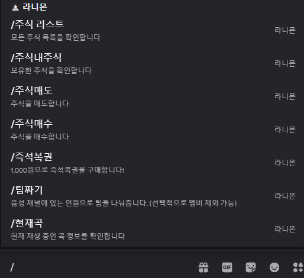
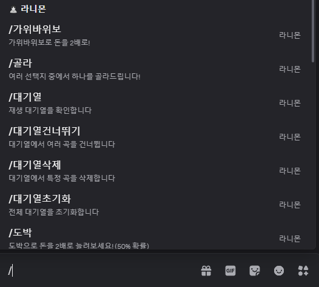

# Ranimon Bot

## 프로젝트 소개
Ranimon Bot은 `discord.js` 기반으로 제작한 올인원 Discord 봇 프로젝트입니다. 단순한 유틸리티 봇을 넘어, 음악 재생, 경제 시스템, 미니게임, 팀 배정, 가상 주식 기능까지 하나의 봇 안에서 유기적으로 동작하도록 구성했습니다. MySQL을 연동해 유저 자산과 활동 데이터를 관리하고, Slash Command 중심의 인터랙션 UI와 버튼·셀렉트 메뉴를 활용해 Discord 안에서 자연스럽게 사용할 수 있는 사용 경험을 구현했습니다.

## 주요 기능
- **음악 재생 시스템**: Lavalink와 Shoukaku를 기반으로 음성 채널 입장, 곡 검색 및 재생, 대기열 관리, 반복·셔플·스킵·일시정지 같은 음악 제어 기능을 구현했습니다.
- **경제 및 미니게임**: 일일 보상, 잔액 조회, 랭킹, 배틀, 가위바위보, 도박 등 반복 참여를 유도하는 서버 공용 경제 시스템을 구성했습니다.
- **가상 주식 시스템**: 주식 목록 조회, 매수·매도, 보유 자산 확인, 수익률 계산, 새로고침 인터랙션까지 포함한 투자형 콘텐츠를 구현했습니다.
- **커뮤니티 보조 기능**: 음성 채널 참여 인원을 기준으로 팀을 자동으로 섞어주는 기능과, 봇 상태를 확인할 수 있는 관리형 유틸리티 기능을 제공합니다.
- **상호작용 중심 UI**: Embed, Button, Select Menu, Slash Command를 적극 활용해 텍스트 명령어보다 직관적인 Discord 내 사용 흐름을 만들었습니다.

## 기술 스택
- **Language**: JavaScript (Node.js)
- **Library / Framework**: `discord.js`, `shoukaku`, `ytdl-core`
- **Database**: MySQL (`mysql2`)
- **Infra / Runtime**: Discord API, Lavalink, dotenv

## 느낀 점
이 프로젝트를 통해 Discord 봇을 단순 응답형 도구가 아니라, 하나의 서비스처럼 설계하는 경험을 할 수 있었습니다. 특히 실시간 상호작용 처리, 음성 채널 상태 관리, DB 트랜잭션 기반 자산 처리, 컴포넌트 UI 구성 등을 직접 구현하면서 이벤트 중심 서버 애플리케이션 구조를 깊이 이해하게 되었습니다. 또한 여러 기능을 한 프로젝트 안에서 함께 운영해보며, 명령어 구조화와 상태 관리, 예외 처리의 중요성을 실무 관점에서 체감할 수 있었습니다.

